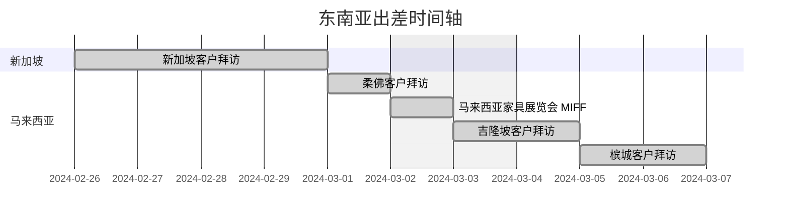

# [240225-240307东南亚出差报告1.1](index.html)

## 已拜访的客户（15/20）

| 序号 |                    已见面客户名                    |   进展   |   级别   |
| :--: | :------------------------------------------------: | :------: | :------: |
|  1   |           **Xing Tek Flooring Pte Ltd**            | 工厂邀约 | **一级** |
|  2   | **Europe Unique Manufacturing & Supplies Pte Ltd** |  已寄样  |   二级   |
|  3   |               **Diamond Asia Tiles**               |   成单   | **一级** |
|  4   |             **Vix Marketing Pte Ltd**              |  已报价  |   二级   |
|  5   |                  **ZGG Pte Ltd**                   |    -     |   三级   |
|  6   |                    Floor Xpert                     |    -     |    -     |
|  7   |              Evorich Holdings Pte Ltd              |  已报价  |    -     |
|  8   |      **MITALEE Carpet & Furnishing Sdn Bhd**       |  已报价  |   二级   |
|  9   |                      M Floor                       | 展会邀约 |   三级   |
|  10  |              Goodrich Global SDN BHD               |   报价   |    -     |
|  11  |             **Floor Zone Enterprise**              |  已报价  | **一级** |
|  12  |                D-Floor(Hous Design)                |    -     |    -     |
|  13  |          **Jia Yee Corporation SDN BHD**           |   寄样   |   二级   |
|  14  |                  First Floor Deco                  |    -     |    -     |
|  15  |                    CK Wholesale                    |    -     |    -     |

> 1.进展分为：报价→已报价→寄样→已寄样→展会邀约→工厂邀约→成单
>
> ​	报价：指对客户关注产品规格报价，客户当下没有明显的下单需求；
>
> ​	已报价：指客户有对其关注产品规格的报价需求，报价后客户可能当下有成可能或在让利后有成单可能；
>
> ​	寄样：指客户有寄样需求，未寄样或寄样未送达；
>
> ​	已寄样：指客户有寄样需求，且寄样送达；
>
> ​	展会邀约：已与客户在展会或展会前后约定见面；
>
> ​	工厂邀约：已与客户约定在工厂见面；
>
> ​	成单：指已经下单客户和未来继续下单客户
>
> 2.客户名加粗为种子客户，种子客户是指在不改变当前价格底线或生产物质资料的前提下，有合作概率的客户

## 价格分类

总述：根据市场客户反馈（具有局限性）LVT产品的市场价格：**新加坡>槟城>柔佛>吉隆坡**

目前根据几个种子客户的价格反馈而言，我们目前LVT产品的报价在新加坡有**0.1~0.2美金/平方**的报价优势，而在槟城5/0.3mm的LVT产品价格大约在**6.3到7.0美金/平方之间**，略低于我们预期价格；柔佛的报价普遍没有反馈。

抗水强化的报价目前仍有优势，不论是在新加坡还是在马来西亚地区。

零售端除了个别以底价策略主攻市场的客户，主要零售客户的拿价基本上4/0.3mm的价格在**10美金/平方**

### 客户期望价格

|   公司名   |   客户名    |     产品规格      | 期望价格($/sqm) |
| :--------: | :---------: | :---------------: | :-------------: |
| XINGFLOORS | Arthur Wong | LVT Click 6/0.7mm |       8.9       |
| XINGFLOORS | Arthur Wong | LVT Click 7/0.7mm |     低于9.6     |
| FLOOR ZONE |   鍾漍泰    | LVT Click 5/0.3mm |     6.3~7.0     |

## 产品分类及关键词

### 新加坡市场

新加坡市场主要以LVT作为市场推广产品，市场方面作为真正大理石的下级替代产品。在不同规格的LVT的产品中，以**LVT4mm+锁扣**为主，**LVT锁扣大尺寸人字拼（635*127mm）**及**超厚（6mm+）超耐磨（0.5mm+）LVT**产品作为各家新品卖点。

在我们调研市场的过程中，总结了当前客户对当前及未来展品发展的需求关键词：

***石纹、麻面、高光/哑光、抗水强化、环保***

### 马来西亚市场

马来西亚市场不同于新加坡市场，SPC有相当大的市场空间，由于本地建厂和合资建厂的缘故，5mm的SPC产品大多数公司选择本地供应，**5.5mm+SPC产品**才会选择从中国采购；

LVT市场和新加坡市场相似，多以**浅压纹**的产品为主，但马来西亚有较大的**LVT粘胶**产品的市场，多为**韩国**采购，且产品背部多采用粗糙质地。

在我们调研市场的过程中，总结了当前客户对当前及未来展品发展的需求关键词：

***加厚SPC、软质LVT、抗水强化、防白蚁***

### 新品推广

对于新加坡市场，多喜欢**浅黄色、无虫洞和结疤的木纹**，以及**仿大理石纹**地板，**高光LVT大理石纹**或**异形拼**可以一定程度上作为宣传点

而马来西亚市场基本与新加坡相差不大，但产品需求量小，客户对于颜色的丰富度和DIY属性尤为看重，所以**软质LVT粘胶**和**异形LVT粘胶**产品可能具有一定的宣传属性

> 东南亚市场似乎尤爱“碳纤维”，不论“碳纤维”是否为真，“碳纤维”是卖点产品，后续可以考虑仿碳纤维纹理的地板产品。

## 构想新品

马来西亚少有客户对真正的新产品有需求，更多时候具有滞后性。

MGO碳晶板、PP地板、PET地板等更多环保上和轻量上更有优势的地板产品

后续周边推广，应该更多针对LVT上墙（我目前还尚未清楚LVT粘胶产品的上墙可能性）、墙板产品等

## 模式

新加坡市场的客户多以承包**政府工程**或**商业工程**为主，本地无工厂，一般为**本地设库**或**代理销售**UNILIN子品牌的产品；

马来西亚市场SPC多采用**本地设厂**生产，强化产品多为本地**Robina的代理商**，LVT进口后本地或多城市**设库销售**，产品一般为**当地零售**，小批量拿货，下游客户多为商业工程、设计师和本地居民

> 我们在陌拜过程中并未重点关注仓储费用和物流费用，在后续和客户保持沟通时我们将会关注此类信息。

## 附加产品

附加产品一般为脚线产品，半数公司会涉及墙板、格栅等产品。当前两国市场脚线价格略高于我们现有供应商。

## 后续规划

| 工作内容                                                     |     时间      |
| :----------------------------------------------------------- | :-----------: |
| 确认Diamond Asia林总的彩膜进度； 将报价单发送给所有种子客户，并设置跟进提醒（每周提醒） |   3月20日前   |
| 筹备XINGFLOORS黄总的样板，包括**普通强化**、抗水强化、已选彩膜、待开发新产品样板（浸胶纸+6mmSPC+平衡纸+1.5mmIXPE & 2mm同质透心+5mmSPC+1mmIXPE） 确认XINGFLOORS黄总具体的到访时间 |   3月22日前   |
| 接待XINGFLOORS黄总参观工厂                                   | 3月24日或25日 |
| 和贺师傅对接Diamond Asia林总下单的问题及后续下单跟进         |    3月25日    |
| 确定展会所需的材料（如产品样本、宣传册、展位设计等），**确保有一定数量的适配东南亚市场的样板参展** |  4月1日~14日  |
| 稳住现有种子客户的基本盘，在网络上以批发商的选择倾向获客，增大展会前的影响力，为二次出差做好准备 |   会前长期    |
| 与东南亚现有非种子和种子客户确认展会邀约信息，规划展会前后的商务洽谈，备好洽谈所需物料； 确认展会期间的报价（一级报价、二级报价） |    4月26日    |
| 与种子客户保证有每周有相当数量的互动                         |   会前长期    |
| 与MFloor Vikash见面探讨脚线辅料及其他产品采购                |    5月27日    |
| 通过展会期间的面对面交流，加深与种子客户的联系，并安排后续的工厂参观； 根据展会上的市场反馈，即时调整报价和销售策略 |  5月28~30日   |
| 完成展会报告，包括客户反馈、市场趋势分析和后续针对不同级别客户的行动计划 |  6月3日~14日  |

## 成长收获及遗憾

### 成长收获

1. 耳听为虚，眼见为实；
2. 不同于纸上谈兵，见面探讨对于本地市场的产品更加真实；
3. 与当前市场客户进行接触，构建东南亚市场，尤其是的新马两国的销售网络；
4. 锻炼了自身临场发挥的能力，面对客户不怯场，不卑微。

### 遗憾

1. 缺乏执行力，消息滞后，效率滞后，工作滞后；
1. 出差前的准备没有重点，携带的物料（例如：强化产品）并没有迎合当地市场；
1. 市场考察不充分，没有提前做好报价准备；
1. 没有对客户的销售路径及市场价格进行很好的探寻，在询价和报价上没有经验
1. 时间安排规划有问题，住宿行程没有一个精确的规划。

**[【返回索引】](index.html)**
