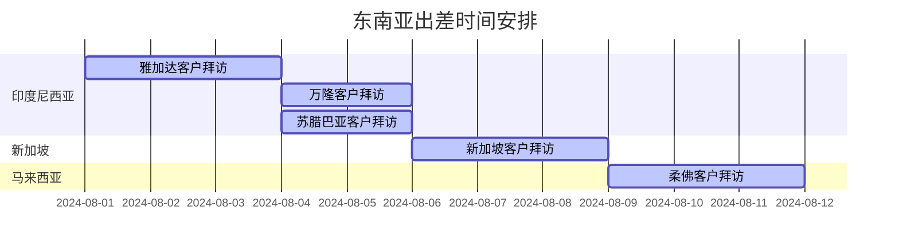

# [东南亚出差计划1](index.html)

> 重点做好出差前与潜在客户的铺垫工作，以及出差的行程安排路线，对每一个客户的已知信息做提前的收集总结工作。

## 出差目的

1. 对越南和印度尼西亚的市场进行市场考察，制定符合当地销路策略的产品部署
2. 对现有新加坡客户进行回访，了解产品销售情况、客户需求以及后续下单意向；
3. 两个新加坡客户商机在面谈后下单可能性很高，出差面谈；
4. 对已建立线上联系的越新印客户进行重点拜访。

> 

## 出差目标

1. 沟通**联系**客户数5个
2. 拜访并**报价**客户数30个,平均2.5个/天
3. **寄样**品客户数5个,下单客户数2个

## 出差地图

出差的地区主要以以下城市为重点陌拜的地区：

- 越南胡志明市
- 越南土龙木市
- 印度尼西亚雅加达
- 印度尼西亚万隆
- 新加坡

## 出差安排

时间:2024年8月,共计12天

### 时间安排

> 印度尼西亚市场以雅加达未核心辐射周边地区，如果我们在雅加达地推工作并未取得有效成绩（指主要产品在该地区无市场）我们后续便会减少在该地区的时间投入；
>
> 下半年具有参考价值的展会不多，本次出差计划中不再提及。

### 路线安排

##      出差物资

### 准备邀约

出差前计划邀约30人,邀约成功8人

### 准备物料

##### 产品宣传类

###### 样品类

- [ ] LVT方板（2mm）刷胶 × 1块
- [ ] LVT方板（5mm）锁扣 × 2块
- [ ] LVT长板（2mm、5mm） × 各1块
- [ ] LVT人字拼（635×125mm） × 4块
- [ ] SPC串板 × 1串(4mm×2+5mm×2+6mm×2；注意不要深压纹)
- [ ] 强化串板(含抗水强化) × 1串(普通强化×2+抗水强化×3)
- [ ] EVA、IXPE(不同发泡倍率)、EVA淋膜样册 × 1本

###### 图文宣传类

- [ ] SPC宣传册 × 30册
- [ ] 产品宣传三折页(抗水强化、耐刮SPC、耐烟烫SPC、~~数码打印~~、~~PP~~、~~PET~~) × 各30张
- [ ] 压纹样册 × 1本
- [ ] 宣传册、彩膜花色、检测报告、证书，硬盘拷贝及云存储 × 1份

##### 沟通联系类

- [x] 名片 * 50张
- [ ] （礼品待筹划）

### 资金支持(预算)

#### 物料费

|          项目          | 数量 | 费用RMB |
| :--------------------: | :--: | :-----: |
| 名片、样板样品及宣传册 |  /   |    0    |
|     （礼品待筹划）     |      |         |
|       **总预算**       |      |         |

#### 交通费

|  时间  |                      项目                       | 费用RMB/人 |
| :----: | :---------------------------------------------: | :--------: |
|        |    机票:上海浦东机场→越南西贡新山一国际机场     |    700     |
|        | 机票:越南西贡新山一国际机场→苏加诺-哈达国际机场 |    600     |
| 3月6日 |     机票:苏加诺-哈达国际机场→新加坡樟宜机场     |    200     |
|        |    机票:越南西贡新山一国际机场→南京禄口机场     |    1500    |
|        |                   **总预算**                    |  **2400**  |

## 产品清单

Date: 
Valid: 
Exchange Rate Fluctuates: 3% **(6.887~7.313)**

|           系列           |          尺寸          | 价格USD(7.1) |
| :----------------------: | :--------------------: | :----------: |
|       LVT Dry Back       |  1220 * 190 * 2/0.2mm  |              |
| LVT Herringbone Dry Back |  635 * 125 * 3/0.2mm   |              |
|       LVT Dry Back       |  1220 * 190 * 3/0.3mm  |              |
|        LVT Click         |  1220 * 180 * 5/0.3mm  |              |
|        LVT Click         |  1220 * 180 * 6/0.5mm  |              |
|           SPC            | 1220 * 180 * 4.0/0.3mm |              |
|           SPC            | 1220 * 180 * 5.0/0.5mm |              |
|   Waterproof Laminate    |  1215 * 195 * 8mm AC3  |              |
|   Waterproof Laminate    | 1215 * 195 * 12mm AC3  |              |
|           EVA            |          1mm           |     0.4      |
|           IXPE           |          1mm           |     0.54     |

## 展会清单

### [印度尼西亚国际建筑建材装饰材料展 INDO BUILD TECH](https://indobuildtech.com/)

#### 时间

印尼本土：2024年6月12日~6月16日

国际：2024年8月7日~8月11日

#### 地点

印尼展覽中心Indonesia Convention Exhibition, Jl. BSD Grand Boulevard No.1, Pagedangan, Kec. Pagedangan, Kabupaten Tangerang, Banten 15339印度尼西亚

#### 展品范围

**建筑材料**：包括各种新型建筑材料、传统建筑材料、建筑装饰材料等。

**建筑机械**：展示用于建筑施工的各类机械设备，如起重机、混凝土搅拌机、钻孔设备等。

**地板与地毯**：实木地板、复合地板、竹地板、PVC地板、地毯等地面铺装材料。

**瓷砖与石材**：室内外使用的瓷砖、大理石、花岗岩、石英石等地面和墙面材料。

**门窗系统**：包括木门、铝合金门窗、塑钢门窗、智能门窗等。

**卫浴设施**：各类卫生洁具、淋浴设备、浴缸、卫生间配件等。

**厨房设备**：整体厨房、厨房电器、橱柜、台面材料等。

**照明产品**：室内外照明设备、LED灯具、智能照明系统等。

**智能家居**：智能家居系统、安防产品、自动化控制系统等。

**节能产品**：涉及节能建筑材料、节能技术、可再生能源利用等。

**暖通空调**：包括中央空调系统、通风设备、空调配件等。

**涂料与化工产品**：建筑涂料、装饰涂料、粘合剂、密封剂等。

**五金工具**：建筑五金、电动工具、手动工具、紧固件等。

**建筑服务**：建筑设计、工程咨询服务、项目管理、建筑信息模型(BIM)等。

> 展会评估：这个展会多倾向于建材市场，具有一定参考性，但是不足以成为出差的主要目标，可以作为8月10日~11日周末两头的部分工作。

## 预期结果

### 出差报告-客户

<table>
    <tr>
        <th align="center" colspan="6" style="font-size: 150%;">客户资料</th>
    </tr>
    <tr>
        <th align="center">客户名</th>
        <td style="width: 150px;"></td>
        <th align="center">国家</th>
        <td style="width: 150px;"></td>
        <th align="center">年采购量</th>
        <td style="width: 150px;"></td>
    </tr>
    <tr>
        <th align="center">地址(邮寄样品)</th>
    </tr>
    <tr>
        <td colspan="6" style="height: 30px;"></td>
    </tr>
    <tr>
        <th align="center">联系人</th>
        <td></td>
        <th align="center">职位</th>
        <td></td>
        <th align="center">联系方式</th>
        <td></td>
    </tr>
    <tr>
        <th align="center" colspan="6">现有产品参数</th>
    </tr>
    <tr>
        <th align="center">产品</th>
        <th align="center">系列名</th>
        <th align="center">花色</th>
        <th align="center">尺寸</th>
        <th align="center">价格</th>
        <th align="center">销量/采购量</th>
    </tr>
    <tr style="height: 30px;">
        <td align="center"></td>
        <td align="center"></td>
        <td align="center"></td>
        <td align="center"></td>
        <td align="center"></td>
        <td align="center"></td>
    </tr>
    <tr style="height: 30px;">
        <td align="center"></td>
        <td align="center"></td>
        <td align="center"></td>
        <td align="center"></td>
        <td align="center"></td>
        <td align="center"></td>
    </tr>
</table>
