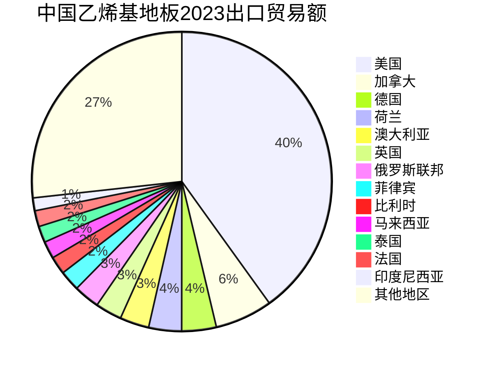

### 市场考察

东南亚分布的主要国家为：新加坡、马来西亚、印度尼西亚、菲律宾、越南、泰国

#### 所见所闻

##### 新加坡

新加坡的地板市场可能是东南亚独一份的特别，当地的SPC地铺产品几乎没有市场，原因在于之前政府工程采购的SPC地铺产品出现了质量事故，直接摧毁了政府和民众对于SPC产品的信任，所以在新加坡PVC类产品**只会有LVT地板的市场**，这样的好处有两个：

- 产品单一，差异化只能在耐磨、尺寸、性能和附加属上做文章
- 不会受到低价区SPC产品的冲击，市场更加看重质价比

同样也有坏处：

- 市场小而需求大，对花色型号的需求比正常客户多
- 对质量要求更高，产品风险也更高

所以新加坡客户的用户画像及需求基本如下：

- **5mm及5mm+** LVT产品
- **多花色**，木纹需要**干净、无虫眼、无裂纹**；
- 偏爱**石纹**产品，以替代瓷砖；
- **Valinge** 2G扣，锁扣紧实；

##### 马来西亚

> 马拉西亚与新加坡有什么不同，为什么不同

马来西亚市场比新加坡低端，主要是由于土地面积和经济发展水平造成的。

对比新加坡，马来西亚土地面积更大，工程及家装的面积更大，对产品的使用更加包容，相较于新加坡的高价市场，在同等品质下单位面积的产品价格更低。

马来西亚经济水平更低，客户粘性低，更愿意为了一点利润而选择当地的生产商，因为中国和韩国的产品质量与本地产品的差距，并不足以支撑高额的利润差。

#### 道听途说

##### 越南

> 为什么要选择越南，以及越南市场怎么样

越南目前两大进口国家分别为**中国（28%）**和韩国（22%）

其中主要的地板进口产品以PVC为主，进口的主要目的为转口贸易或者居家自用。

越南目前本土PVC地板生产集中在越南北部的城市，而越南南部的城市，例如胡志明市存在一定数量的从中国进口的产品。可以预估到的是，除了转口贸易带来的进口量，在越南南部确实会存在一定高品质产品的生存空间。

|         地区 | 2023出口额（亿美元） |
| -----------: | :------------------- |
| **胡志明市** | **超过 424.6**       |
|       北宁省 | 超过 393             |
|   **平阳省** | **超过 306**         |
|       海防市 | 近 268               |
|       太原省 | 近 257               |
|     北宁江省 | 近 245               |
|   **同奈省** | **超过 216**         |
|       河内省 | 超过 166             |
|       富寿省 | 近 106               |
|       永福省 | 近 100               |

根据针对当地市场在售产品的官网信息进行收集整理可以得到以下信息：

> 品牌参考：
>
> - [Vinyl Flooring || Vibuma.com](https://vibuma.com/en/building-materials/carpets-vinyl/vinyl-flooring.html)
> - [PVC Flooring || Vibuma.com](https://vibuma.com/en/building-materials/carpets-vinyl/pvc-flooring.html)

###### LVT类

常见规格：

- 粘胶 914.4×152.4mm
- 粘胶 457.2×457.2mm
- 锁扣 912×150mm Unilin

厚度上，耐磨一般以0.1mm为主，厚度一般为1.6(卷材)、2.0和3.0mm，质保1年；而锁扣类耐磨厚度为0.3mm，总厚度为4mm，极少部分可以达到5mm。

总体上，目前越南在使用的**PVC类地板普遍为低端产品线**，用户对于质保和使用年限并没有太高需求，一般为1-2年，同时价格也非常低廉，粘胶类产品普遍在3-4美金每平方，卷材偏多。

> 电商平台:
>
> - [Vinyl Floor | Lazada](https://www.lazada.vn/catalog/?spm=a2o4n.homepage.search.d_go&q=Sàn vinyl)
> - [Vinyl Floor | Shopee](https://shopee.vn/search?keyword=sàn vinyl)

高品质产品存在59×9in规格5/0.5mm的LVT粘胶地板，只有品牌才有在做4mm、5mm，耐磨在0.3、0.5mm、0.55mm的LVT地板

> 在做该方面低端市场时，必须要了解粘胶产品要用什么胶水，考虑到价格和粘贴能力。
>
> - **RECOMMENDED ADHESIVE:** M95.0 Resilient Flooring Adhesive, M99 Resilient Flooring Adhesive, or M700 Adhesive
>   推荐粘合剂：M95.0 弹性地板粘合剂、M99 弹性地板粘合剂或 M700 粘合剂

###### SPC类

常见规格：

- 粘胶 500×500mm
- 粘胶 1530×253mm
- 锁扣 915×152mm Unilin
- 锁扣 1219.2×177.8mm(48×7in) Unilin
- 锁扣 1500/1513/1522/1524×180/223/230/238mm Unilin
- 锁扣 1219/1220/1227×182/184/187mm Unilin

锁扣产品厚度一般为4.0、4.5、5.5、6.5，粘胶产品一般为2.5、3mm；耐磨厚度一般为0.3和0.5mm。

> 针对越南南部的市场调研来看，南方城市的SPC类产品进口数量欠缺，多数在越南北部采购或自建工厂。

###### 强化类

常见规格：

- 1380×142.5mm
- 1200/1220×190/192.5/196mm

厚度一般为8mm、10mm（少）和12mm厚，耐磨AC3和AC4，部分公司有AC5，其AC3仅有2000r。

> 强化产品规格：[Laminate flooring sizes - standard dimensions chart (rempros.com)](http://www.rempros.com/dimensions/laminate-flooring-sizes.html)

综上来看，越南的自用市场是十分低端的市场，存在大量的劣质产品竞争，在基本可以满足自给自足的情况下，中高端的产品很难在当地立足。

##### 印度尼西亚

###### 印度尼西亚对于中国

2023年，中国对印度尼西亚的乙烯基地板出口量在全年总出口数据中排名第13位，占总贸易额的1%。

###### 中国对于印度尼西亚

纵观2018-2023年的印度尼西亚进口乙烯基地板的数据，除了2019年数据异常（2019年印度尼西亚进口额高于其他年平均30%，且法国成为其第一进口来源，不符合正常市场规律）所展现出来的印度尼西亚乙烯基地板市场，稳定可持续，且中国出口印度尼西亚的占比连年高升。

|            | 贸易流向 | 产品代码 | 年份 | 合作地区 | 贸易额(1k USD) | 贸易额占比(%) |  数量(kg)  | 数量占比(%) |
| :--------: | :------: | :------: | :--: | :------: | :------------: | :-----------: | :--------: | :---------: |
| 印度尼西亚 |   进口   |  391810  | 2018 |   中国   |   24,623.97    |   **47.3**    | 20,711,900 |  **44.5**   |
| 印度尼西亚 |   进口   |  391810  | 2019 |   中国   |   34,157.07    |   **33.6**    | 31,114,300 |  **33.5**   |
| 印度尼西亚 |   进口   |  391810  | 2021 |   中国   |   54,012.13    |   **71.2**    | 51,797,000 |  **72.3**   |
| 印度尼西亚 |   进口   |  391810  | 2022 |   中国   |   57,488.78    |   **74.2**    | 57,585,900 |  **77.2**   |
| 印度尼西亚 |   进口   |  391810  | 2023 |   中国   |   73,662.41    |   **84.6**    | 67,198,100 |  **86.0**   |
> 参考链接：
>
> - [中国乙烯基地板2023年出口数据报告 | Data (worldbank.org)](https://wits.worldbank.org/trade/comtrade/en/country/CHN/year/2023/tradeflow/Exports/partner/ALL/product/391810)
> - [印度尼西亚乙烯基地板2018年进口数据报告 | Data (worldbank.org)](https://wits.worldbank.org/trade/comtrade/en/country/IDN/year/2018/tradeflow/Imports/partner/ALL/product/391810)
>
> - [印度尼西亚乙烯基地板2019年进口数据报告 | Data (worldbank.org)](https://wits.worldbank.org/trade/comtrade/en/country/IDN/year/2019/tradeflow/Imports/partner/ALL/product/391810)
>
> - [印度尼西亚乙烯基地板2021年进口数据报告 | Data (worldbank.org)](https://wits.worldbank.org/trade/comtrade/en/country/IDN/year/2021/tradeflow/Imports/partner/ALL/product/391810)
>
> - [印度尼西亚乙烯基地板2022年进口数据报告 | Data (worldbank.org)](https://wits.worldbank.org/trade/comtrade/en/country/IDN/year/2022/tradeflow/Imports/partner/ALL/product/391810)
>
> - [印度尼西亚乙烯基地板2023年进口数据报告 | Data (worldbank.org)](https://wits.worldbank.org/trade/comtrade/en/country/All/year/2023/tradeflow/Exports/partner/IDN/product/391810)

### 总结

从目前线下和线上考察东南亚地区的市场来看，东南亚市场很难匹配我司当前的定位，并非代表东南亚地区没有该类型的客户，而是该市场的机遇不大，理由为以下三点：

- 产品定位：我司的产品定位及价格高于该地区市场的常规产品，在其他公司提供低性能产品的围剿下，我司现有产品很难在当地市场存活下来；
- 公司定位：我司一直试图以高品质产品及售后服务作为营销的增值点，而该地区的低质保策略和高更换频率却难以匹配；
- 客户定位：我司的客户要求是能保证每个月稳定增量在2个柜以上的客户，该地区的客户运转周期长，体量小，花色多，会增加我司在成本上的风险。

如果需要继续开拓该地区的市场，公司需要考虑以下情况：

- 需要为东南亚的低价区调整符合该市场地区的配方及价格；
- 承担更高的彩膜库存风险