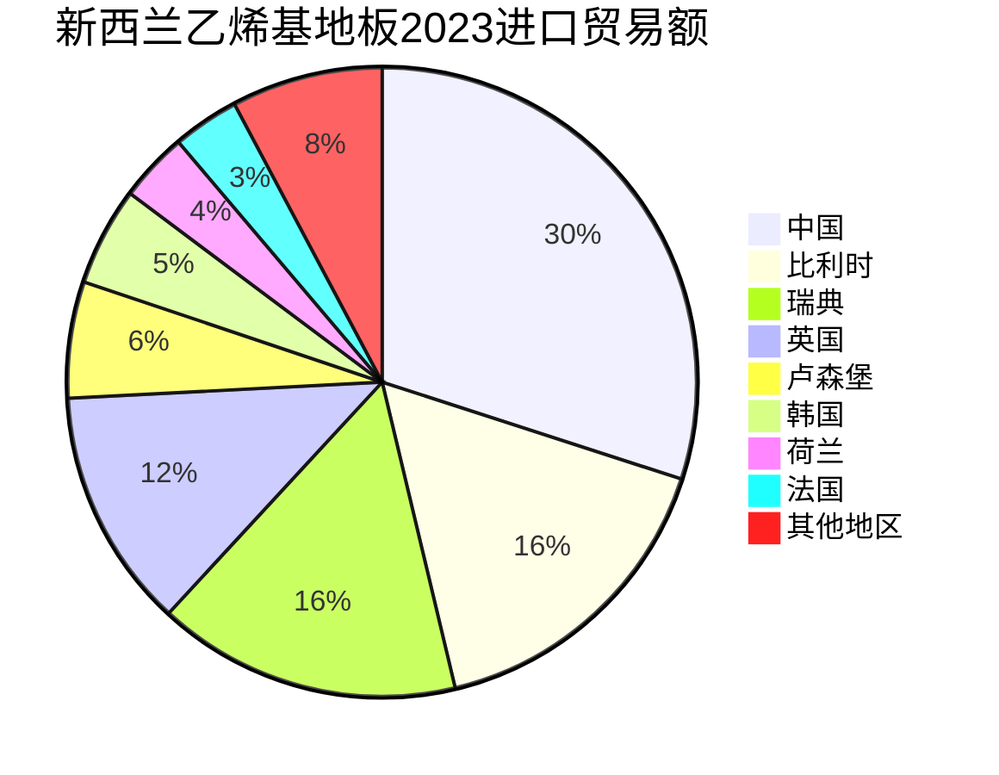

新西兰地板市场调研及开发

市场调研

> 为什么选择新西兰市场

新西兰属于澳洲的一部分，但是从悉尼到新西兰首都奥克兰超过2000公里，直飞航程大约在3小时。相较于澳大利亚的大面积国土，新西兰面积更小，市场更透明。

<iframe src="https://www.google.com/maps/@-40.6921444,168.5033952,5z?entry=ttu" width="600" height="450" frameborder="0" style="border:0" allowfullscreen></iframe>

新西兰和澳大利亚一样同属澳洲的发达国家，根据世界银行的市场分析报告可以得出，新西兰目前的乙烯基地板进口市场前位仍然被高价位产品所占据，越南的低价产品并未得到该市场认可。

|        | 贸易流向 | 产品代码 |  产品描述  | 年份 | 贸易合作地区 | 贸易额 (1000美元) |    数量     | 数量单位 |
| :----: | :------: | :------: | :--------: | :--: | :----------: | :---------------: | :---------: | :------: |
| 新西兰 |   进口   |  391810  | 乙烯基地板 | 2023 |   ~~世界~~   |     33,769.58     |  1,258,920  |   千克   |
| 新西兰 |   进口   |  391810  | 乙烯基地板 | 2023 |   **中国**   |   **10,125.97**   | **381,935** | **千克** |
| 新西兰 |   进口   |  391810  | 乙烯基地板 | 2023 |    比利时    |     5,498.82      |   208,025   |   千克   |
| 新西兰 |   进口   |  391810  | 乙烯基地板 | 2023 |     瑞典     |     5,268.70      |   196,470   |   千克   |
| 新西兰 |   进口   |  391810  | 乙烯基地板 | 2023 |     英国     |     4,157.65      |   157,202   |   千克   |
| 新西兰 |   进口   |  391810  | 乙烯基地板 | 2023 |    卢森堡    |     2,018.91      |   763,768   |   千克   |
| 新西兰 |   进口   |  391810  | 乙烯基地板 | 2023 |     韩国     |     1,711.65      |   647,531   |   千克   |
| 新西兰 |   进口   |  391810  | 乙烯基地板 | 2023 |     荷兰     |     1,205.84      |   443,839   |   千克   |
| 新西兰 |   进口   |  391810  | 乙烯基地板 | 2023 |     法国     |     1,157.48      |   378,108   |   千克   |
| 新西兰 |   进口   |  391810  | 乙烯基地板 | 2023 |   澳大利亚   |      746.63       |   281,345   |   千克   |
| 新西兰 |   进口   |  391810  | 乙烯基地板 | 2023 |     德国     |      487.65       |   184,483   |   千克   |
| 新西兰 |   进口   |  391810  | 乙烯基地板 | 2023 |     美国     |      297.81       |  45,414.6   |   千克   |
| 新西兰 |   进口   |  391810  | 乙烯基地板 | 2023 | 其他亚洲国家 |      224.16       |  84,800.8   |   千克   |
| 新西兰 |   进口   |  391810  | 乙烯基地板 | 2023 |     越南     |      198.45       |  76,332.4   |   千克   |

纵观新西兰乙烯基地板2018-2023年进口数据，排名前三的始终为中国、比利时、瑞典，数据反映出两个信号：

1. 中国的乙烯基地板产品已经抢占了新西兰30%左右的市场
2. 中国的乙烯基地板产品的新西兰市场价格与比利时和瑞典并无差距

|             | 贸易流向 | 产品代码 | 年份 | 合作地区 | 贸易额(1k USD) | 贸易额占比(%) |   数量(kg)   | 数量占比(%) |
| :---------: | :------: | :------: | :--: | :----------: | :---------------: | :------: | :--------: | :--------: |
| 新西兰 |   进口   |  391810  | 2018 |    比利时    |     5,323.46      | 20.3 |   2,090.26   |   20.6   |
| 新西兰 |   进口   |  391810  | 2018 |   **中国**   |   **4,850.79**   | **18.5** | **1,910.47** | **18.9** |
| 新西兰 | 进口 | 391810 | 2018 | 瑞典 | 4,057.93 | 15.5 | 1,577.58 | 15.6 |
| 新西兰 |   进口   |  391810  | 2019 |   **中国**   |   **6,975.82**    | **23.6** | **3,026.34** | **24.1** |
| 新西兰 |   进口   |  391810  | 2019 |    比利时    |     5,529.55      | 18.7 |   2,389.21   |   19.0   |
| 新西兰 |   进口   |  391810  | 2019 |     瑞典     |     4,678.60      | 15.9 |   2,006.78   |   16.0   |
| 新西兰 |   进口   |  391810  | 2022 |   **中国**   |   **13,816.30**   | **36.2** | **5,628.33** | **36.7** |
| 新西兰 |   进口   |  391810  | 2022 |    比利时    |     5,859.71      | 15.4 |   2,356.13   |   15.4   |
| 新西兰 |   进口   |  391810  | 2022 |     瑞典     |     5,610.59      | 14.7 |   2,290.30   |   15.0   |
| 新西兰 |   进口   |  391810  | 2023 |   **中国**   |   **10,125.97**   | **30.0** | **381.935**  | **30.3** |
| 新西兰 |   进口   |  391810  | 2023 |    比利时    |      5,498.82      | 16.3 |   208.025   |   16.5   |
| 新西兰 |   进口   |  391810  | 2023 |     瑞典     |     5,268.70      | 15.6 |   196.470    |   15.6   |

> 参考链接：
>
> - [新西兰乙烯基地板2018年进口数据报告 | Data (worldbank.org)](https://wits.worldbank.org/trade/comtrade/en/country/NZL/year/2018/tradeflow/Imports/partner/ALL/product/391810)
>
> - [新西兰乙烯基地板2019年进口数据报告 | Data (worldbank.org)](https://wits.worldbank.org/trade/comtrade/en/country/NZL/year/2019/tradeflow/Imports/partner/ALL/product/391810)
>
> - [新西兰乙烯基地板2022年进口数据报告 | Data (worldbank.org)](https://wits.worldbank.org/trade/comtrade/en/country/NZL/year/2022/tradeflow/Imports/partner/ALL/product/391810)
>
> - [新西兰乙烯基地板2023年进口数据报告 | Data (worldbank.org)](https://wits.worldbank.org/trade/comtrade/en/country/NZL/year/2023/tradeflow/Imports/partner/ALL/product/391810#)

