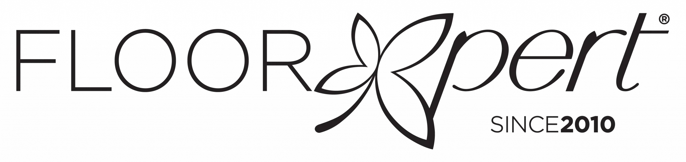

# 东南亚出差计划

## 出差目的

1. 参加展会，了解新加坡、马来西亚等东南亚国家地板市场，包括：LVT(vinyl)、SPC、强化地板Laminate、实木多层地板Engineered；
2. 对现有客户进行拜访，推广新产品（防水强化、耐磨SPC、防烟烫SPC）
3. 拜访有联系的客户，试探客户的下单意向，打消客户疑虑。

### 具体流程

## 出差目标

1. 拜访客户数25个，平均2.5个/天
2. 展会接触客户数15个，平均7.5个/天
3. 寄样品客户数4个，下单客户数1个

## 出差地图

<iframe src="https://www.google.com/maps/d/u/0/embed?mid=1FrHxu-eomb0e9uCq3-e7WsH6S_pxur0&ehbc=2E312F&noprof=1" width="640" height="480"></iframe>

## 出差安排

时间：2024年2月26日~3月6日，共计10天

### 时间安排

### 路线安排

<table>
    <tr>
        <th align="center" colspan="6" style="font-size: 150%;">路线安排</th>
    </tr>
    <tr>
        <th align="center">陌拜时间</th>
        <th align="center">客户抬头</th>
        <th align="center">陌拜地区</th>
    </tr>
   	<tr>
        <th align="center" rowspan="3">2月26日（周一）</th>
        <td align="center">XINGFLOOR</td>
        <td align="center">新加坡</td>
    </tr>
    <tr>
        <td align="center">The Floor Gallery</td>
        <td align="center">新加坡</td>
    </tr>
    <tr>
        <td align="center" style="color:#FF0000">Foreign Unique Marketing</td>
        <td align="center">新加坡</td>
    </tr>
    <tr>
        <th align="center" rowspan="4">2月27日（周二）</th>
        <td align="center" style="color:#FF0000">Floor Xpert Pte Ltd.</td>
        <td align="center">新加坡</td>
    <tr>
        <td align="center">Vinyl floor Singapore by Modernwood PL</td>
        <td align="center">新加坡</td>
    </tr>
	<tr>
        <td align="center">Vix Marketing Pte Ltd</td>
        <td align="center">新加坡</td>
    </tr>
	<tr>
        <td align="center">Zween Designs</td>
        <td align="center">新加坡</td>
    </tr>
    <tr>
        <th align="center" rowspan="3">2月28日（周三）</th>
        <td align="center">Lexsure flooring sinapore Pte Ltd</td>
        <td align="center">柔佛</td>
    </tr>
    <tr>
        <td align="center" style="color:#FF0000">Mitalee Carpet & Furnishing Sdn. Bhd.</td>
        <td align="center">柔佛</td>
    </tr>
    <tr>
        <td align="center">JL Concepts</td>
        <td align="center">柔佛</td>
    </tr>
    <tr>
        <th align="center" rowspan="4">2月29日（周四）</th>
        <td align="center">meiko penang</td>
        <td align="center">槟城</td>
    <tr>
        <td align="center">PERGO Malaysia Headquarters</td>
        <td align="center">槟城</td>
    </tr>
	<tr>
        <td align="center">Vix Marketing Pte Ltd</td>
        <td align="center">槟城</td>
    </tr>
	<tr>
        <td align="center">Floor Depot Jelutong</td>
        <td align="center">槟城</td>
    </tr>
    <tr>
        <th align="center" rowspan="3">3月1日（周五）</th>
        <td align="center">Floor Zone Enterprise</td>
        <td align="center">槟城</td>
    <tr>
        <td align="center">D FLOORING & WALLCOVERING ENTERPRISE</td>
        <td align="center">槟城</td>
    </tr>
    <tr>
        <td align="center">FIRST FLOOR DECO</td>
        <td align="center">槟城</td>
    </tr>
    <tr>
        <th align="center">3月2日（周六）</th>
        <td align="center" rowspan="2" style="color:#0000FF; font-size: 140%; vertical-align: middle;">MIFF展会</td>
        <td align="center" rowspan="2" style="font-size: 110%; vertical-align: middle;">吉隆坡</td>
    </tr>
    <tr>
		<th align="center">3月3日（周日）</th>
    </tr>
    <tr>
        <th align="center" rowspan="3">3月4日（周一）</th>
        <td align="center">Headline Flooring</td>
        <td align="center">吉隆坡</td>
    <tr>
        <td align="center">Maju Jaya Carpets</td>
        <td align="center">吉隆坡</td>
    </tr>
    <tr>
        <td align="center">Goodrich Global Sdn. Bhd</td>
        <td align="center">吉隆坡</td>
    </tr>
    <tr>
        <th align="center" rowspan="3">3月5日（周二）</th>
        <td align="center">Top Floor Specialist</td>
        <td align="center">吉隆坡</td>
    <tr>
        <td align="center">Absolute Asia flooring</td>
        <td align="center">吉隆坡</td>
    </tr>
    <tr>
        <td align="center">Floor Gallery Malaysia</td>
        <td align="center">吉隆坡</td>
	</tr>
    <tr>
        <th align="center" rowspan="3">3月6日（周三）</th>
        <td align="center" style="color:#FF0000">CSS Floorings & Wallcoverings Sdn. Bhd.</td>
        <td align="center">吉隆坡</td>
    <tr>
        <td align="center">Nafi Malaysia Sdn</td>
        <td align="center">吉隆坡</td>
    </tr>
    <tr>
        <td align="center">Woody Top Floor Renovation</td>
        <td align="center">吉隆坡</td>
    </tr>
</table>

##      出差物资

### 准备邀约

出差前计划邀约30人，邀约成功8人

### 准备物料

#### 产品宣传类

- [ ] 样板册（白色基材SPC、强化、实木）* 各1册
- [ ] LVT样板无锁扣、锁扣 * 各1张
- [ ] EVA、IXPE（不同发泡倍率）、EVA淋膜小样 * 各1张
- [ ] 锁扣样品（Unilin、Valinge、5Gi）* 各2个
- [ ] SPC宣传册 * 5册
- [ ] 产品宣传三折页（抗水强化、耐刮SPC、耐烟烫SPC、数码打印、PP、PET） * 各50张
- [ ] 宣传册、彩膜花色、检测报告、证书，硬盘拷贝及云存储 * 1份

#### 沟通联系类

- [x] 名片 * 50张
- [ ] 邀请函 * 30张
- [ ] 10寸折扇 * 30把

### 资金支持（预算）

#### 物料费

|                             项目                             | 数量 |  费用RMB  |
| :----------------------------------------------------------: | :--: | :-------: |
|                    名片、样板样品及宣传册                    |  /   |     0     |
| <a href='https://detail.1688.com/offer/733681402039.html' target="_blank">邀请函</a> |  30  |   25.6    |
| <a href='https://detail.1688.com/offer/556408713251.html' target="_blank">10寸折扇</a> |  30  |    139    |
|                          **总预算**                          |      | **164.6** |

#### 交通费

|  时间   |                      项目                      | 费用RMB/人 |
| :-----: | :--------------------------------------------: | :--------: |
| 2月25日 | 机票：上海浦东机场/南京禄口机场→新加坡樟宜机场 |    1000    |
| 2月28日 |    机票：马来西亚新山机场→马来西亚槟城机场     |    200     |
| 3月1日  |   机票：马来西亚槟城机场→马来西亚吉隆坡机场    |    200     |
| 3月6日  |     机票：马来西亚吉隆坡机场→南京禄口机场      |    1200    |
|         |                   **总预算**                   |  **2400**  |

#### 住宿费

|       时间        |            项目             | 费用RMB/2人*天 |
| :---------------: | :-------------------------: | :------------: |
|  2月25日~27日(2)  |   住宿：新加坡 樟宜湾酒店   |      713       |
|  2月27日~28日(1)  |     住宿：新山 Z Hotel      |      370       |
| 2月28日~3月1日(2) |   住宿：槟城 慕蒂亚拉酒店   |      208       |
| 3月1日~3月5日(5)  | 住宿：吉隆坡 彭亨路万枫酒店 |      400       |
|                   |         **总预算**          |    **4212**    |

#### 餐饮费

|    地区     | 费用RMB/人*天 |
| :---------: | :-----------: |
|  新加坡(3)  |      125      |
| 马来西亚(7) |      115      |
| **总预算**  |   **3430**    |

**总计预算：￥10206.6**

## 人员安排

<table>
    <tr>
        <th align="center">类别</th>
        <th align="center">具体工作安排</th>
        <th align="center">负责人</th>
    </tr>
    <tr>
        <td align="center">市场</td>
        <td align="center">
            1.记录客户采购来源，包括：国家地区、采购公司/外贸公司 
            2.记录客户的现有产品类型，包括：产品系列、规格、价格 
            3.记录客户市场定位、销售渠道，以及销售过程遇到的问题
        </td>
        <td align="center"></td>
    </tr>
    <tr>
        <td align="center">销售</td>
        <td align="center">
            1.讲解产品信息：性能参数、优势卖点 
            2.答疑解惑，解决客户当前遇到的问题 
        </td>
        <td align="center"></td>
    </tr>
    <tr>
        <td align="center">行政</td>
        <td align="center">
        	1.收集客户名片、样板 
            2.向客户展示样品，及样品性能 
            3.记录客户产品需求 
            4.赠与礼品以及邀请函
        </td>
        <td align="center"></td>
    </tr>
</table>
## 产品清单

Date: 2024/01/23
Valid: 2024/04/30
Exchange Rate Fluctuates: 3% **(6.887~7.313)**

|     系列     |          尺寸          | 价格USD(7.1) |
| :----------: | :--------------------: | :----------: |
| LVP Dry Back |  1220 * 190 * 2/0.2mm  |     3.97     |
| LVP Dry Back |  914 * 153 * 3/0.2mm   |     4.57     |
| LVP Dry Back |  1220 * 190 * 3/0.3mm  |     4.77     |
|     SPC      | 1220 * 180 * 3.7/0.5mm |     5.30     |
|     SPC      | 1220 * 180 * 4.0/0.3mm |     5.33     |
|     SPC      | 1220 * 180 * 5.0/0.5mm |     6.41     |
|   Laminate   |  1215 * 195 * 8mm AC3  |              |
|   Laminate   | 1215 * 195 * 12mm AC3  |              |
|     EVA      |          1mm           |     0.4      |
|     IXPE     |          1mm           |     0.54     |

> 选择4.0/0.3和3.7/0.5两个不同尺寸，是因为一方面4.0/0.3的尺寸足够常见，客户接受度高，生产成本稳定；另一方面3.7/0.5的与4.0、0.3的产品价格相当（3.7/0.5的价格更低）如果客户对耐磨有更高的需求时，我们可以转而推荐，让客户从中取舍。

> LVT 914 * 153 与 1220 * 190 同质同价
>
> SPC 1220 * 180mm 与 1220 * 230mm 同质同价

## 拜访清单

### 老客户

1. Harvest City Asia Pte Ltd.-林总 

### 新客户

#### 新加坡

1. [Foreign Unique Marketing](https://foreignunique.com/) 
2. [Floor Xpert Pte Ltd.](https://floorxpert.com/) 

#### 马来西亚

1. [CSS Carpet And Wallpaper Sdn. Bhd.](https://www.csscarpet.com.my/index.php) 
2. [Mitalee Carpet & Furnishing Sdn. Bhd.](http://www.mitalee.com.my/) 

## 展会清单

### [马来西亚家具展览会 MIFF](https://miff.com.my/)

 

#### 时间

2024年3月1日~3月4日

#### 地点

马来西亚-吉隆坡-41 Jalan Tun Ismail, Kuala Lumpur-吉隆坡太子世界贸易中心

#### 主办方

马来西亚博闻公司

#### 展品范围

**家具类别：** 卧房家具、餐厅家具、厨房家具、床褥、沙发组合、儿童家具、户外/庭院家具、客厅家具、特制家具

**办公家具：** 电脑家具、办公椅、办公桌、办公屏风/间隔、保险箱

**材料及配件：** 竹藤、玻璃、皮革、大理石、金属、塑胶、白藤、石头、铁丝、藤、木材、地毯和毛毯、窗帘/卷帘、组件设备、装饰配件、布料、工艺品、皮革、灯饰、亚麻布、沙发、**地板**、木线、墙板铺设材料

> [展会门票申请](https://miff.com.my/register-now/)（需注册后申请预约）
>
> 

## 预期结果

### 出差报告-客户

<table>
    <tr>
        <th align="center" colspan="6" style="font-size: 150%;">客户资料</th>
    </tr>
    <tr>
        <th align="center">客户名</th>
        <td style="width: 150px;"></td>
        <th align="center">国家</th>
        <td style="width: 150px;"></td>
        <th align="center">年采购量</th>
        <td style="width: 150px;"></td>
    </tr>
    <tr>
        <th align="center">地址（邮寄样品）</th>
        <td colspan="6" colspan="5"></td>
    <tr>
    <tr>
        <th align="center">联系人</th>
        <td></td>
        <th align="center">职位</th>
        <td></td>
        <th align="center">联系方式</th>
        <td></td>
    </tr>
    <tr>
        <th align="center" colspan="6">现有产品参数</th>
    </tr>
    <tr>
        <th align="center">产品</th>
        <th align="center">系列名</th>
        <th align="center">花色</th>
        <th align="center">尺寸</th>
        <th align="center">价格</th>
        <th align="center">销量/采购量</th>
    </tr>
    <tr style="height: 30px;">
        <td align="center"></td>
        <td align="center"></td>
        <td align="center"></td>
        <td align="center"></td>
        <td align="center"></td>
        <td align="center"></td>
    </tr>
    <tr style="height: 30px;">
        <td align="center"></td>
        <td align="center"></td>
        <td align="center"></td>
        <td align="center"></td>
        <td align="center"></td>
        <td align="center"></td>
    </tr>
</table>

### 出差报告-总结

出差报告分成三次进行总结，分别在展会前（新加坡、马来西亚柔佛、槟城地区）、展会后，以及出差后（马来西亚吉隆坡地区）

主要需要在不同市场考察及客户拜访结束时回答以下问题：

1. 针对不同地区的地板市场，其**市场价格**是否符合预期：新加坡 > 槟城 > 柔佛 > 吉隆坡，与我们低价/性价比策略**最契合的市场**是哪一或哪几块市场？
2. 目前可以获得的，当地市场中有哪些是进口我国产品、进口山东的产品，我们的**主要竞争对手**有哪些？哪些公司采取了低价策略？
3. 展会中及陌拜过程中，可以观察到达的当地产品的**宣传卖点**是什么？是否可以拿到客户的样板？

------

<a href="goal.html" target="_blank">2024东南亚销售业绩目标计划表</a>

<a href="2024aExhibition.html" target="_blank">2024上半年东南亚及国内展会</a>

<a href="2024bExhibition.html" target="_blank">2024下半年东南亚及国内展会</a>

<a href="Q&A.html" target="_blank">客户问与答</a>
